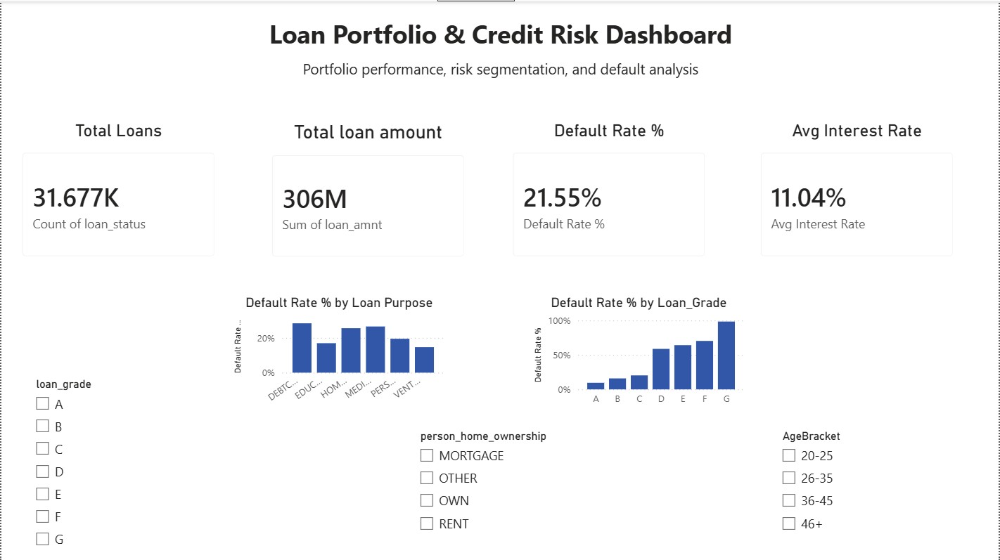

Loan Portfolio & Credit Risk Dashboard (Power BI)

An automated Power BI dashboard analyzing loan portfolio performance, credit risk, and default trends across 31,000+ loan records. Built as a self-directed portfolio project to demonstrate data cleaning, DAX, drillthrough interactivity, and automated Excel-to-report refresh — the kind of BA deliverable used in fintech risk and collections reporting.

Business Problem

Risk and collections teams need visibility into which loan segments (grade, purpose, income bracket, age, home ownership) carry the highest default risk, so they can prioritize underwriting policy reviews and collections outreach. This dashboard answers: where is default risk concentrated in the portfolio, and which defaulted loans represent the largest exposure?

Data Source

Credit Risk Dataset (Kaggle, laotse) — ~32,000 simulated credit bureau records (income, loan amount, interest rate, loan grade, default status, home ownership, employment length).

Data Cleaning (Power Query)
Verified person_age and person_emp_length for outliers using full-dataset column profiling (not the default 1,000-row sample) — no invalid values found in this copy of the dataset
loan_int_rate had ~9-10% nulls. Rather than dropping those rows or using a flat average, nulls were imputed using the median interest rate for that loan's grade (via a helper query grouped by loan_grade), preserving the natural risk-based pricing relationship between grade and rate
Added calculated columns: AgeBracket, IncomeBracket, DefaultStatusText for readable segmentation in visuals
Dashboard Pages
Overview — portfolio KPIs (Total Loans, Total Loan Amount, Default Rate %, Avg Interest Rate) plus default rate by loan grade and by loan purpose
Risk Segmentation — default rate by income bracket, age bracket, and home ownership, with synced cross-page slicers
Loan Purpose Detail (drillthrough page) — right-click any loan purpose bar on the Overview page to drill into purpose-specific KPIs, dynamically filtered
Default Analysis — a sortable table of individual defaulted loans (age, income, grade, amount, purpose, ownership) for collections prioritization, plus a total defaulted loans count
Key DAX Measures

See docs/dax_measures.md for the full list with explanations.

Automation

This report is set up to refresh automatically when the source Excel file (hosted on OneDrive) is updated, using Power BI Service's scheduled refresh — no manual re-upload or re-publish needed. See docs/automation_flow.md for the setup and flow.

Tools Used

Power BI Desktop, Power BI Service, Power Query (M), DAX, Excel, OneDrive

Screenshots

This is a self-directed learning project built to practice and demonstrate Business Analyst / BI skills — not affiliated with any employer or client data.
